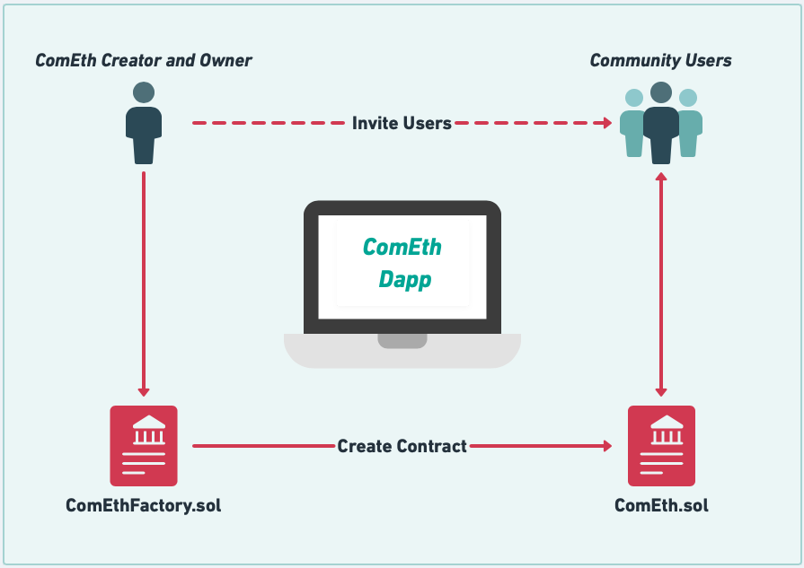

# ComEth Dapp BackEnd Architecture

### - Solidity version 0.8.5

### Architecture version 0.1




---

### Install the Repository :

```zsh
git clone https://github.com/Benmissi-A/ComEth
yarn
```
---

### Test librairies :

- Ethers Js
- Chai

---

### You need to add at your environment a file .env :

```
INFURA_PROJECT_ID="<your infura project ID>"
DEPLOYER_PRIVATE_KEY="<your private Key>"
```

---

### Development environment :

- Hardhat
- Docgen
- Openzeppelin Contracts
- Dotenv

---

### Use of Database Postgresql with Prisma.

